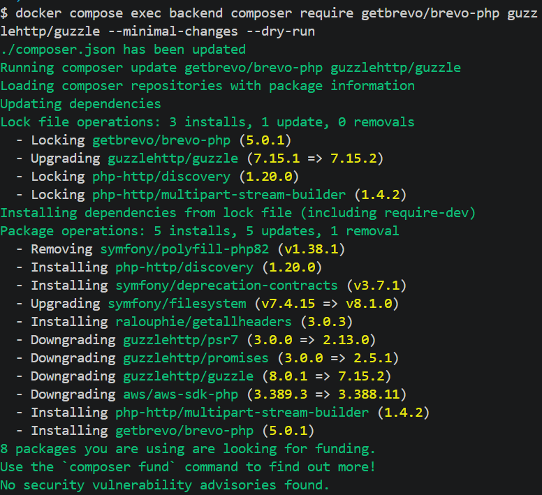
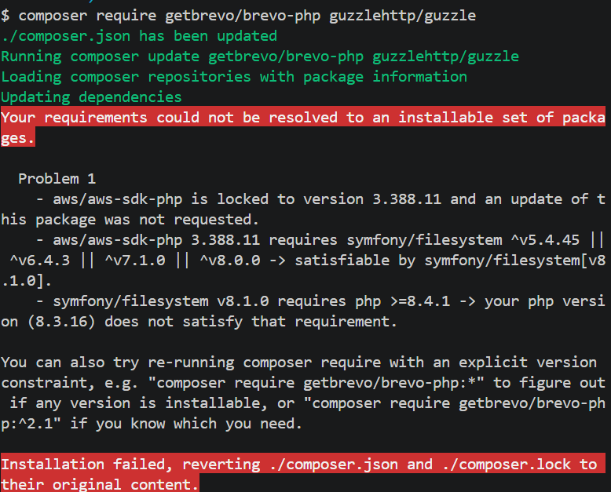
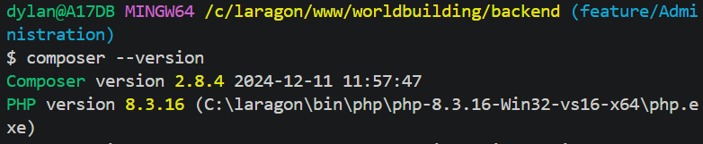
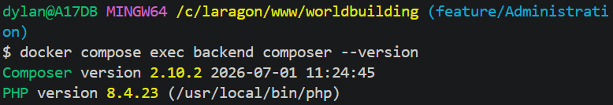

# SECURITE

## BackEnd

Configuration du compte root (administrateur) et du compte utilisateur (backend)
lors de la configuration de Minio via le service Minio-init des docker compose dev et prod

---

    command:
      - |

## créer le compte admiistrateur (root)

        until mc alias set local http://minio:9000 "$${MINIO_ROOT_USER}" "$${MINIO_ROOT_PASSWORD}" --api S3v4 --path on; do
          sleep 2
        done

## créer le compte utilisateur (backend) pour l'accès au bucket

        mc mb --ignore-existing "local/$${MINIO_BUCKET}"
        mc admin user add local "$${MINIO_ACCESS_KEY}" "$${MINIO_SECRET_KEY}" || true

## défini les droits d'accès du compte utilisateur (backend) sur le bucket

        mc admin policy create local cms-media /policies/cms-policy.json
        mc admin policy attach local cms-media --user "$${MINIO_ACCESS_KEY}"

## créer un fichier de test dans le bucket pour vérifier que Minio et l'accès backend fonctionne

        mc cp "/mock-data/01/test.txt" "local/$${MINIO_BUCKET}/01/test.txt"

---

### configuration copier du local vers le volume Minio, donne les droits suivant (ecriture/lecture) à l'utilisateur BackEnd

    volumes:
      - ./docker/minio/mock-data:/mock-data:ro
      - ./docker/minio/cms-policy.json:/policies/cms-policy.json:ro

---

```
{
  "Version": "2012-10-17",
  "Statement": [
    {
      "Effect": "Allow",
      "Action": [
        "s3:GetObject",
        "s3:PutObject"
      ],
      "Resource": [
        "arn:aws:s3:::users-data/*"
      ]
    }
  ]
}
```

---

## PHP GD

installation de php GD via le backend/dockerfile afin de permettre de vérifié les images reçu
Verifie le type mime
verifie "l'octet de signature" ou le -magic number- qui donne l'identité réel du fichier upload (jpg et non un .exe)
la taille et recréer l'image pour supprimer les metadonée ou contenu malveillant ajouter

---

worldbuilding\backend\core\MediaUploadValidator.php

        $valid = match ($mime) {

## Verification du type mime et de la signature octet par sécurité (magic number)

            "image/jpeg" => str_starts_with($header, "\xFF\xD8\xFF"),
            "image/png" => str_starts_with($header, "\x89PNG\r\n\x1A\n"),
            "image/gif" => str_starts_with($header, "GIF87a") || str_starts_with($header, "GIF89a"),
            "image/webp" => substr($header, 0, 4) === "RIFF" && substr($header, 8, 4) === "WEBP",
            "image/avif" => substr($header, 4, 4) === "ftyp"
                && (
                    in_array(substr($header, 8, 4), ["avif", "avis"], true)
                    || str_contains(substr($header, 16), "avif")
                    || str_contains(substr($header, 16), "avis")
                ),
            "video/mp4" => substr($header, 4, 4) === "ftyp",
            "video/webm" => str_starts_with($header, "\x1A\x45\xDF\xA3"),
            default => false,
        };

---

## FrontEnd

ajout de Regex pour l'email et mot de passe

---

```
^ : début de la chaîne.
[^\s@]+ : un ou plusieurs caractères qui ne sont ni un espace (\s) ni un arobase (@).
@ : exige exactement un arobase.
[^\s@]+ : exige un domaine non vide (ex: gmail mais pas de contraite forte)
\. : exige un point littéral. Le point est échappé, car . seul signifie «n’importe quel caractère » en regex.
[^\s@]+ : exige une extension non vide après le point.
$ : fin de la chaîne.
```

---

```
const EMAIL_PATTERN = /^[^\s@]+@[^\s@]+\.[^\s@]+$/
const PASSWORD_PATTERN = /^(?=.*[A-Z])(?=.*\d)(?=.*[^A-Za-z0-9\s]).{8,}$/
```

---

Accepte:

test@example.com
prenom.nom@example.fr
contact+site@sub.example.org
a@b.c

---

---

Refuse:

testexample.com // aucun @
test@example // aucun point après le @
@example.com // partie locale vide
test@.com // domaine vide
test example@test.com // espace interdit
test@@example.com // plusieurs @

---

---

# Brevo

Configuration du domaine côté Brevo (verification via le provider : OVH)
permettant d'enviyer 
)


anonymisation du suivi email (Brevo collecte des data sur les envoi/ouverture d'email) par default c'est "non"
Cette option empêche d’associer les ouvertures et clics à une adresse précise. Brevo conserve néanmoins des statistiques anonymisé


il faut Desactiver le tracking Brevo sans consentement, par defauil il traque tous même sans conentement explicite


Ne conserva pas le contenu HTML du Mail par default, supprime les logs apres 1mois


---

# probleme rencontrer

## autorisation des fichiers servi par Nuxt dans le Nginx config

generation du contenu nuxt via SSG avec la commande docker compose exec frontend npm run generate
créer parfois des erreurs dans la console du navigateur du au anciennes données dans le cache
obliger de restart le service docker front via : docker compose restart frontend

---

---

Breevo - installations des packets
docker compose exec backend composer require getbrevo/brevo-php guzzlehttp/guzzle --minimal-changes
verifications des problèmes lié au versioning, version lock par Minio (AWS), version lock par Nginx (Symfony)
Test avec le supplément de commande --dry-run pour voir les changements de version sans modification réel

commande faite dans /worldbuilding


commande faite dans /worlbuilding/backend


possible cause : j'ai essayer d'installer le packet Brevo en local sans passer par Docker compose exec ce qui a utiliser ma version PHP local et non cella du container docker (8.3.16 local vs 8.4.23 docker) ce qui a créer une erreur




deuxième constat, les versions ont downgrade et n'était donc pas a leur version locked, probablement a cause de docker install fait en local et non côté docker

appris : toujours passer par docker compose exec backend composer require/install
afin d'utiliser la même version PhP (local vs docker)

---


## deploiement 

Perte de MDP VPS ovh, banni par fail2ban (3echec connexion) récupération via boot en rescue et connexion de la console KVM de ovh, mise de l'ip local en whiteliste fail2ban

---

création du certificat HTTPS via let's encrypt (certbot) 